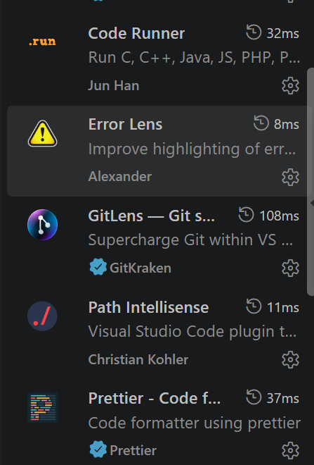

1.多级标题
# 一级标题#

## 二级标题

### 三级标题
#### 四级标题
##### 五级标题
###### 六级标题
不同级的标题其实就是不同数量的#的个数

2.
列表
有序列表
- 苹果
- 香蕉
  - 小米椒
  - 帝王叫
* 橙子
所以说了列表要用到的就是-/* /+/
无序列表

3.
表格 

|平台名称 | 是否开放 | 获取API key |  
| ---- | ---- | ---- |
| 质朴 | 开放 | open.bigmodel.cn |
| DeepSeek | 开放 | platform.deepseek.com |


为啥这个不行呢 我已经问了半天豆包了 CAO 我好饿
我终于弄好了...没话说
其实说白了就是要有|| 然后写完表格那层后要及时|----|----|----|
靠了很烦的 然后还有|:---|左对齐   |---:|右对齐   |:---:|居中

4.代码块

行内代码` client.chat.completions.create `

```python
from openai import OpenAI
client = OpenAI(
    api_key="sk-xxx",
    base_url="https://api.deepseek.com"
)
```
本质就是```里面是语言名比如说python c ```


5.超链接


[百度](https://www.baidu.com/)

其实这个超链接说白了就是[]   ()
[]方框里边填名字 ()这个里面填的是文字

6.图片引用

```
反正是咋说呢
```

7.数学公式基础

```
无非就是用了$这里编写你要写的$
```
`
C:\Users\lzt\Documents\Obsidian Vault\AI作业.md


